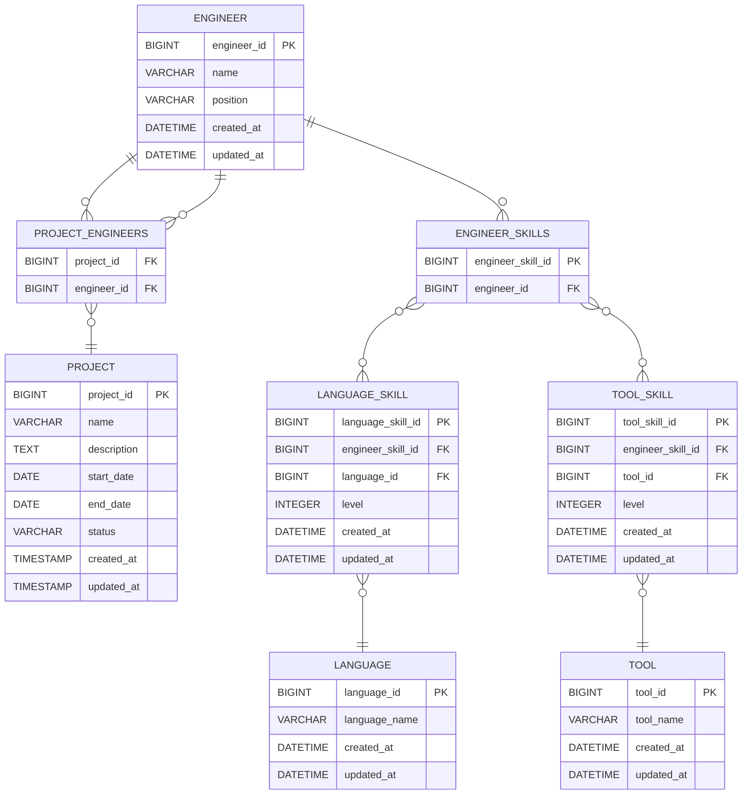

```mermaid
erDiagram
    ENGINEER {
            BIGINT engineer_id PK
            VARCHAR name
            VARCHAR position
            DATETIME created_at
            DATETIME updated_at
        }

    PROJECT {
            BIGINT project_id PK
            VARCHAR name
            TEXT description
            DATE start_date
            DATE end_date
            VARCHAR status
            TIMESTAMP created_at
            TIMESTAMP updated_at
        }

    PROJECT_ENGINEERS {
            BIGINT project_id FK
            BIGINT engineer_id FK
        }

    ENGINEER_SKILLS {
            BIGINT engineer_skill_id PK
            BIGINT engineer_id FK
        }

    LANGUAGE_SKILL {
            BIGINT language_skill_id PK
            BIGINT engineer_skill_id FK
            BIGINT language_id FK
            INTEGER level
            DATETIME created_at
            DATETIME updated_at
        }

    LANGUAGE {
            BIGINT language_id PK
            VARCHAR language_name
            DATETIME created_at
            DATETIME updated_at
        }

    TOOL_SKILL {
        BIGINT tool_skill_id PK
        BIGINT engineer_skill_id FK
        BIGINT tool_id FK
        INTEGER level
        DATETIME created_at
        DATETIME updated_at
        }

    TOOL {
            BIGINT tool_id PK
            VARCHAR tool_name
            DATETIME created_at
            DATETIME updated_at
        }

    ENGINEER ||--o{ PROJECT_ENGINEERS : ""
    PROJECT_ENGINEERS }o--|| PROJECT : ""
    PROJECT_ENGINEERS }o--|| ENGINEER : ""
    ENGINEER ||--o{ ENGINEER_SKILLS : ""
    ENGINEER_SKILLS }o--o{ LANGUAGE_SKILL : ""
    LANGUAGE_SKILL }o--|| LANGUAGE : ""
    ENGINEER_SKILLS }o--o{ TOOL_SKILL : ""
    TOOL_SKILL }o--|| TOOL : ""
```
